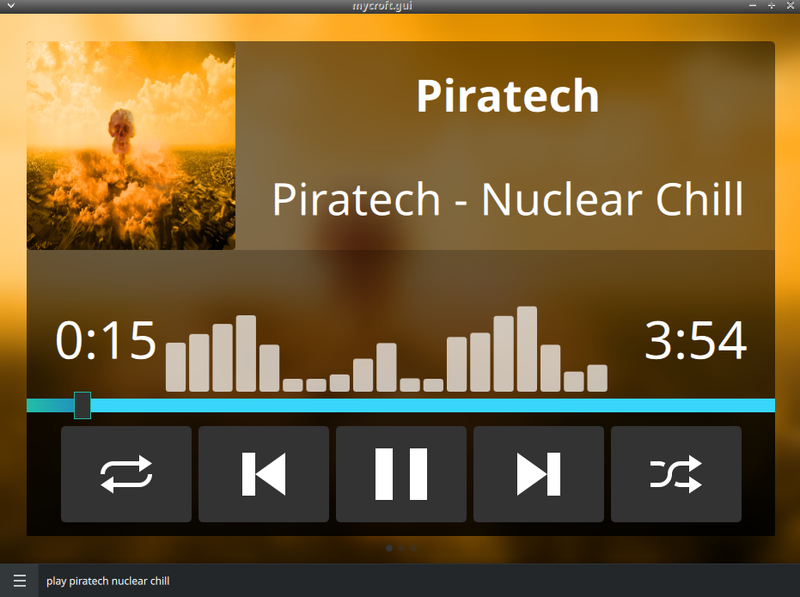

> # ⚠️ DEPRECATED
>
> This OCP **search skill** is deprecated and unmaintained. OCP search skills
> (`OVOSCommonPlaybackSkill` + `@ocp_search`) are replaced by **MediaProvider**
> plugins loaded in-process by the
> [`ovos-ocp-pipeline-plugin`](https://github.com/OpenVoiceOS/ovos-ocp-pipeline-plugin),
> which dispatches search to them — the replacement is
> [`ovos-media-provider-soundcloud`](https://github.com/OpenVoiceOS/ovos-media-provider-soundcloud).
> The package is published, but it only does anything once the OCP pipeline's
> MediaProvider dispatch is the default search path — installing it does not
> replace this skill under the legacy OCP/`ovos-audio` stack. `ovos-media` is
> a separate component (the player daemon) and is not involved in search.
>
> - **How MediaProviders work / how to migrate:** https://github.com/OpenVoiceOS/ovos-media/blob/dev/docs/media-providers.md
> - **Base-class deprecation:** [ovos-workshop#423](https://github.com/OpenVoiceOS/ovos-workshop/pull/423)
>
> This skill keeps working until the OCP pipeline's MediaProvider dispatch
> becomes the default search path and this repository is archived.

#  Soundcloud Skill

soundcloud skill for OCP

## About

search soundcloud by voice!

## Examples
* "play piratech in soundcloud"
* "play piratech nuclear chill"

## Credits
JarbasAl

## Category
**Entertainment**

## Tags
- soundcloud
- OCP
- common play
- music
